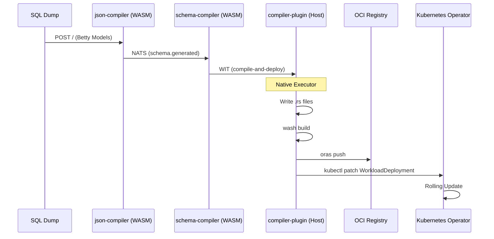

# Kompilre: Compiler Host Plugin

A **wasmCloud Host Plugin** that provides a high-performance, native execution engine for the **Kompilre** schema compiler pipeline. It implements the `kompilre:compiler/compiler-api` WIT interface, allowing sandboxed WASM components to orchestrate native build tools (`wash`), OCI registries (`oras`), and Kubernetes clusters (`kubectl`).

## Overview

Kompilre is a schema-to-deployment pipeline that automates the generation of data-layer WASM components from SQL schemas. While the schema parsing and code generation happen in sandboxed WASM components (`json-compiler` and `schema-compiler`), the **Compiler Host Plugin** handles the "last mile" operations that require host-level permissions:

1.  **File Writing**: Synchronizing generated SeaORM entity source code to the host filesystem.
2.  **Compilation**: Orchestrating a full Rust build using `wash build`.
3.  **Distribution**: Pushing the built WASM component to a private OCI registry.
4.  **Deployment**: Performing a zero-downtime rolling update of the running `WorkloadDeployment` in Kubernetes.

## The Pipeline



## WIT Interface

The plugin fulfills the following interface defined in `wit/world.wit`:

```wit
package kompilre:compiler@0.1.0;

interface compiler-api {
    record entity-file {
        name: string,
        content: string,
    }

    /// Receive generated entity .rs files, run wash build, push to OCI, 
    /// and trigger a wasmCloud rolling update.
    compile-and-deploy: func(
        files: list<entity-file>,
        registry-url: string,
        image-tag: string,
    ) -> result<string, string>;
}
```

## Internal Execution Flow

When `compile-and-deploy` is invoked, the plugin executes a synchronous pipeline on the host:

1.  **I/O Sync**: Writes the provided list of `entity-file` records (e.g., `user.rs`, `mod.rs`) into the `crates/entities/generated/` directory within the configured `GRAPHILY_REPO_ROOT`.
2.  **Native Build**: Spawns a `wash build` process in the `crates/entities/` directory. This performs a full Cargo build to create a wasmCloud component binary.
3.  **Binary Location**: Locates the resulting binary at `build/graphily_entities_s.wasm`.
4.  **OCI Push**: Uses `oras push` to upload the WASM layer to the target registry (e.g., `localhost:5002/graphily/entities:latest`) with the required OCI content type: `application/vnd.module.wasm.content.layer.v1+wasm`.
5.  **K8S Patch**: 
    *   Fetches the current state of the target `WorkloadDeployment` using `kubectl get`.
    *   Identifies the specific component by name (default: `graphily-entities`).
    *   Applies a JSON patch (`kubectl patch --type=json`) to update the image reference.
    *   Triggers the wasmCloud Kubernetes operator to perform a rolling update.

## Configuration

The plugin is configured via environment variables on the wasmCloud host:

| Variable | Default | Description |
| :--- | :--- | :--- |
| `GRAPHILY_REPO_ROOT` | `.` | Root path of the static-graphily repository. |
| `SKIP_DEPLOY` | `unset` | Set to `1` to build and push but skip Kubernetes patching. |
| `GRAPHILY_WORKLOAD` | `graphily` | Name of the `WorkloadDeployment` in Kubernetes. |
| `GRAPHILY_NAMESPACE` | `graphily` | Kubernetes namespace for the deployment. |
| `GRAPHILY_ENTITIES_COMPONENT` | `graphily-entities` | Name of the component within the workload spec. |

## Setup & Dependencies

The following tools must be available on the system `PATH` where the wasmCloud host is running:

1.  **`wash`**: The wasmCloud CLI for building components.
2.  **`oras`**: For OCI registry operations.
3.  **`kubectl`**: For Kubernetes orchestration (must have valid cluster access).
4.  **Rust Toolchain**: `wasm32-wasip2` target must be installed via `rustup`.

## Registration

To use this plugin, register it during the wasmCloud host initialization:

```rust
use kompilre_compiler::CompilerProvider;

let host = ClusterHostBuilder::new()
    .with_plugin(Arc::new(CompilerProvider::new()))
    // ... other plugins like MySqlProvider
    .build();
```